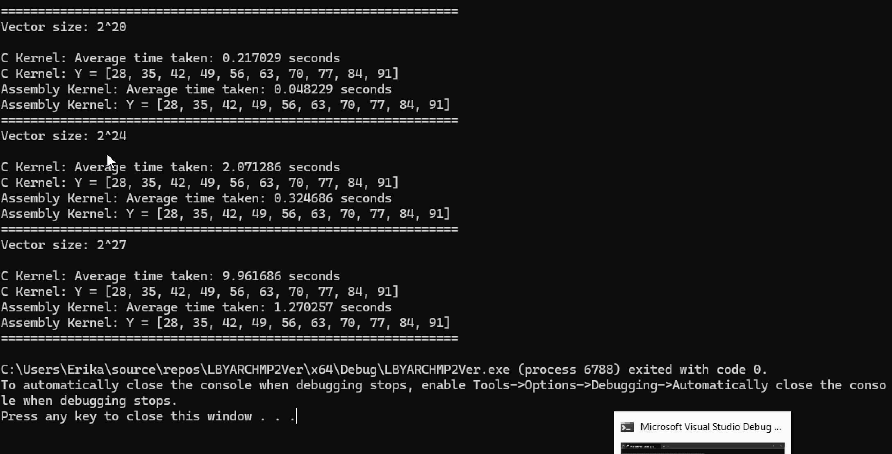
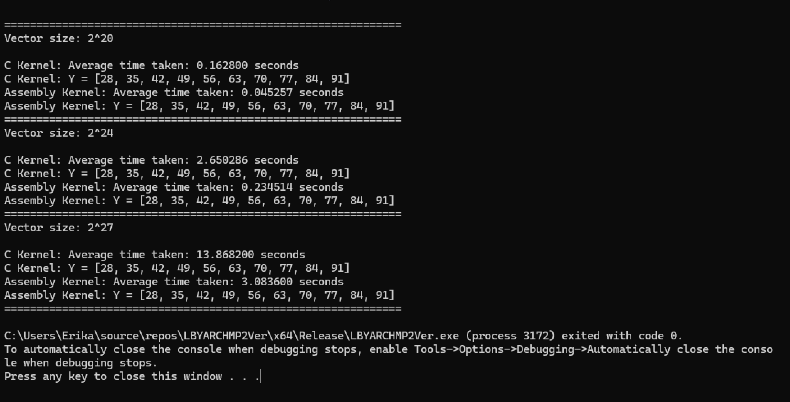

# Comparative Execution Time
### C
### x86-64

# Correctness Check (C)
- screenshots of program output here

| DEBUG | RELEASE |
| ------- | ------- |
|  | |

# Correctness Check (x86-64)
- screenshots of program output here

## 
